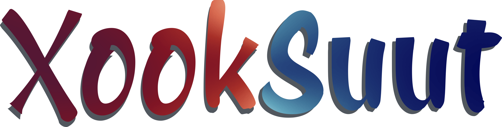
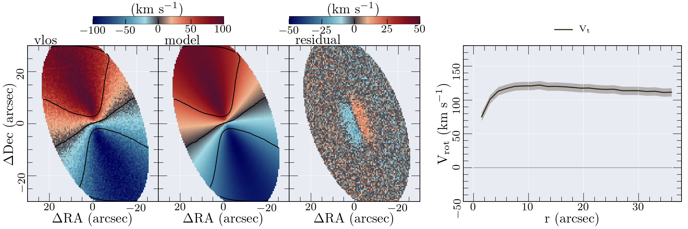
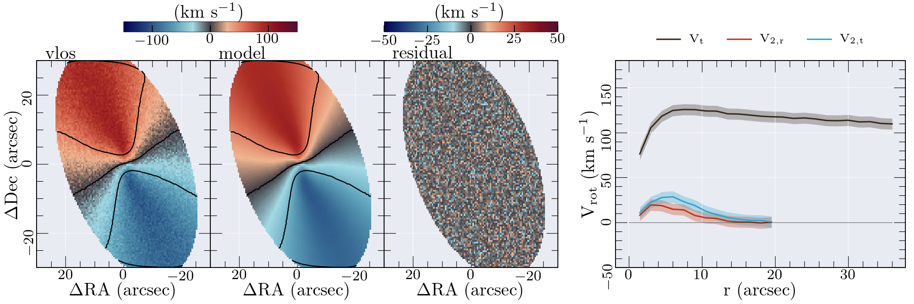
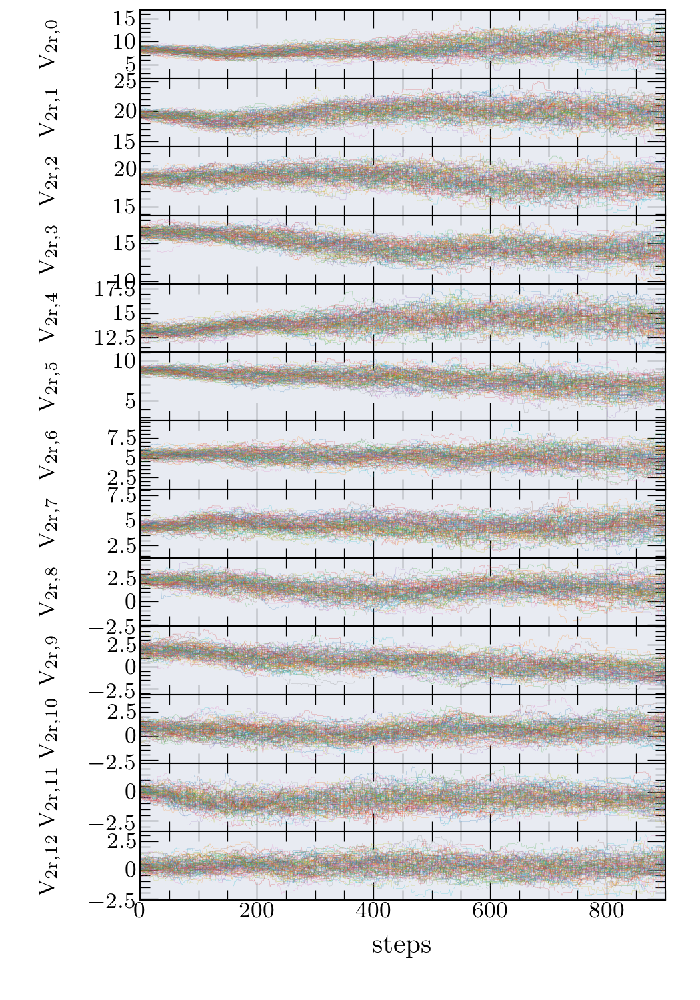
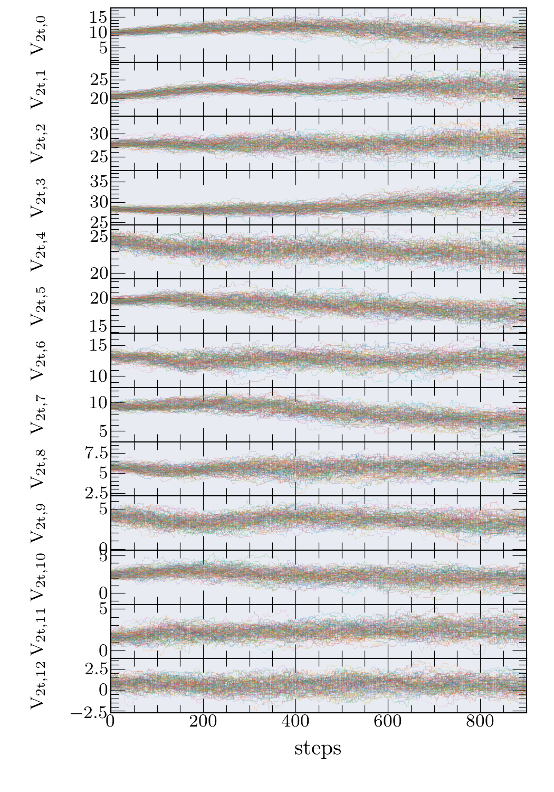
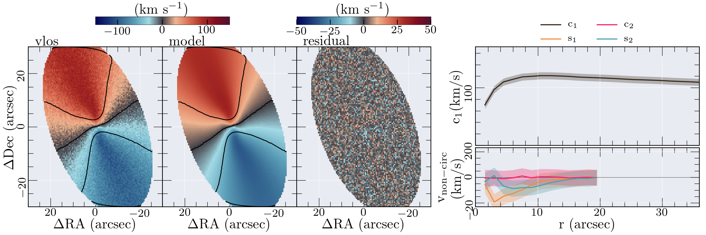

*******************************************
XookSuut (XS)
*******************************************

|logo|

====

:Authors: Carlos Lopez Coba, LiHwai Lin, Sebastian F. Sanchez
:Contact: carlos.lopezcoba@gmail.com

Description
===========
XookSuut or XS for short, is a python tool developed to model non-circular motions on 2D velocity maps,
such as those obtained from Integral Field Spectroscopy data, i.e., stellar and ionized-gas velocity maps; even though  XS can run
on any velocity map whose representation is in 2D maps.
In order to derive the best kinematic model XS performs a Least-Squares analysis together with Bayesian inference methods to survey
the propability space given by the Posterior distribution, or the volume space ocupied by the priors.
XS adopts the most popular MCMC algorithms (emcee & zeus), and Dynamic Nested sampling (dynesty) to infer the best fit parameters.
XS is able to model circular rotation models, axisymetric radial flows, bisymmetric flows, and a general harmonic decomposition of the LOSV.
In order to derive the best set of parameters on each kinematic model XS uses all spaxels from the input velocity
map; thus, large images could take time large CPU time for deriving the best model. 

Dependencies
===========

            * ::
            
                Python >= 3.6

Installation
===========

1. Go to the XookSuut-code directory
cd /XookSuut-code/

2.  pip install -e .
-e stands for editable, meaning that you will be able to work on the script and invoke the latest version without need to reinstall.

3. Try it. Go to any folder and type XookSuut

you must get the following ::

USE: XookSuut name vel_map.fits [error_map.fits,SN] pixel_scale PA INC X0 Y0 [VSYS] vary_PA vary_INC vary_X0 vary_Y0 vary_VSYS ring_space [delta] Rstart,Rfinal cover kin_model fit_method N_it [R_bar_min,R_bar_max] [config_file] [prefix]

Uninstall
===========

pip uninstall XookSuut

Use
===========

XS is designed to run in command line, but you can easely set-up a python script .py so you can run it as a script.
This last could be very usefull in case you want to analyse several objects in parallel !
Please read the run_example.txt file to see how to run XS.
XS requires a 2D velocity map in (km/s) and optionally a map containing the uncertainties on the velocities.
In addition, XS requires guess values for the disk geometry, and parameters describing the rings position on the galaxy plane.
Another input is the desired kinematic ic model, and in the case of non-circular models, the maximum radial extention of the non-circular flows.

Examples
===========
Following are some of the outputs you will obtain from running XS on a velocity map. These examples correpond to a simulated velocity map with an oval distortion.

Results for circular rotation model:
|circ|

Radial flow model:
|rad|

Bisymmetric model:
|bis|

Corner plot of constant parameters (i.e, PA, INC, XC, YC, PA_BAR):
|corner|

V2r chain. 
|chain_rad|

V2t chain
|chain_tan|

Harmonic expasion with harmonic number m  = 2
|hrm|

Referencing XookSuut
=================

If you are using XS in your work, please cite the XS release paper (), and dont forget citing DiskFit (Spekkens & Sellwood 2007) and RESWRI (Schoenmakers et al. 1997) since XS
includes kinematic models from these two codes.
XS relies on the following MCMC packages: emcee from (Foreman-Mackey+2013), Zeus (Karamanis+2021,2022); and Dynesty (Speagle 2020, Koposov +2022) for Nested sampling.
Also, if you use the XS colormap (red-black-blue) in a different context, I would appreciate it, if you include XS in the acknowledgment section.

.. |rad| image:: kin_radial_model_example.png
    :scale: 20 %
    :target: https://github.com/CarlosCoba/XookSuut-code

.. |corner| image:: corner.bisymmetric_model.example.png
    :scale: 10 %
    :target: https://github.com/CarlosCoba/XookSuut-code

